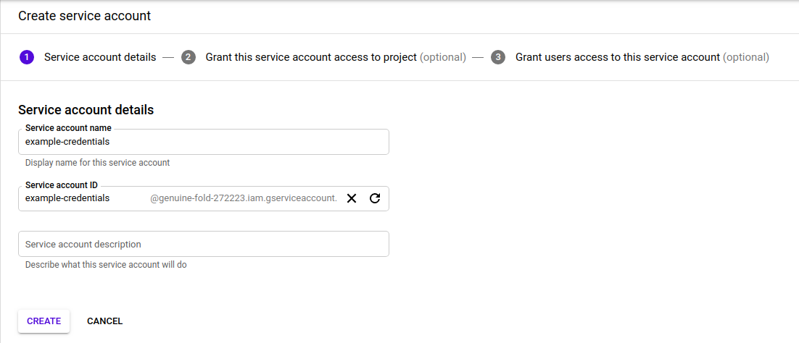

# How to create a bucket in google cloud storage?

Guide to create a bucket step by step in google cloud to store files

### Let’s start

Visit the webpage [google cloud](https://cloud.google.com/) and create an account. When you create the account follow the next steps.

### Step 1: Create bucket

- #### *Go to storage and click in +create bucket*

- #### Name your bucket

- #### Choose where to store your data

- #### Choose a default storage class for your data

- #### Choose how to control access to objects

- #### Advanced settings (optional)

#### Bucket Created:

### Step 2: Create the credentials

- #### Go to API's & Services

- #### Next go to credentials in the left menu

- #### Click on CREATE CREDENTIALS

- #### Select Service account

- #### Insert the name for the service account. The description is optional.

- #### Select the role Owner

- #### Click on Create key. Grant users access is optional.

- #### Select JSON in key type and click on create

- #### The file with the credentials will be download

  File downloaded
  

- #### Finally click on Done

**If everything is correct you can see the credential created**

**Now you have to add the json file to your project**